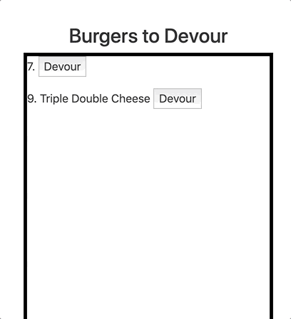

# Eat-Da-Burger
>An App for creating, saving, devouring your favorite burgers.

## MVP
  - [X] Burger added to left list after created
  - [X] Burger moved to right list after devoured
  - [X] Homemade ORM
    - [X] sellectAll method
    - [X] insertOne method
    - [X] updateOne method
  - [X] Model
    - [X] ORM
    - [X] MySQL
  - [X] Views
    - [X] Handlebars
    - [X] Main layout
    - [X] Button partial
  - [X] Controller
    - [X] Route to get burgers
    - [X] Route to create burger
    - [X] Route to update(devour)
  - [X] Hosted to heroku
  
## Developmental Feature
  - [ ] Allow burger to be undevoured
  - [ ] Front-end decorations with burger theme

## Technoology Used
  - [Express](https://www.npmjs.com/package/express)
  - [Express-Handlebars](https://www.npmjs.com/package/express-handlebars)
  - [Handlebars](https://handlebarsjs.com/)
  - [MySQL](https://www.npmjs.com/package/mysql)
  - Node.js
  - ORM
  - Heroku Enviroment Variables and Deployment
 
## Usage
- [Open App](https://blooming-falls-70859.herokuapp.com/)
- Create your Burger and click add
  > 
- Burger is added to "Burgers to Devour" list
  > 
- Click devourn button to add burger to "Burgers Devoured" list
  > 
  
 
